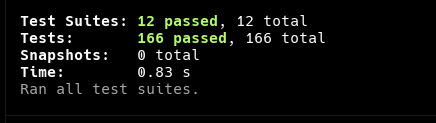

# chaiCodeAssignment

## Main-class Assignment

### OOJ
- [ ] cerate own polyfill library for string arrays to learn prototye and this 

### 5 - NodeJs Internals and Architecture
- [ ] Read blog on Node.js
- [ ] Make video on libuv

### 5 - Chai Aur Express
- [ ] Complete remaining TODOs
- [ ] Explore `process.exit()` and related functions
- [ ] Write blog on serialization and deserialization
- [ ] Draw on Excalidraw / eco-map and make a video

---

## T-class Assignment

### DOM Assignment
- [ ] Dark mode toggle:
        If in dark mode → button shows "Light Mode"
        If in light mode → button shows "Dark Mode"
- [ ] Edit functionality:
        Click data → becomes editable → press Enter → updates data
- [ ] Write blog on:
        NodeList vs HTMLCollection

---

## Github-Class Assignment

- [x] js-conditionals
  - Screenshot:
    
- [ ] js-datatypes-foundation
- [ ] js-functions
- [ ] js-loops
- [ ] js-datatypes
- [ ] js-async-oops
- [ ] js-dom
